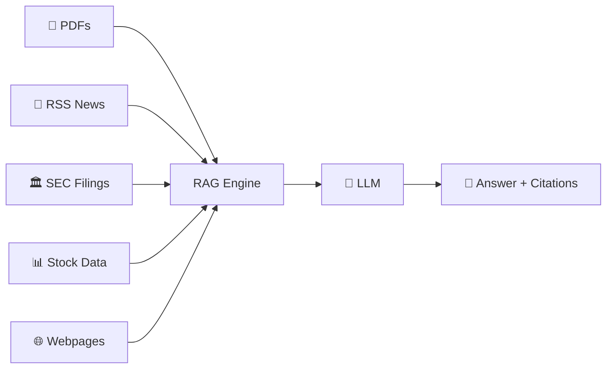

<div align="center">

# 📈 Finance LLM

### *Your 80-Year Wall Street Veteran — Powered by RAG*

[](https://python.org)
[](https://openai.com)
[](https://anthropic.com)
[](https://ollama.ai)
[](https://streamlit.io)
[](https://fastapi.tiangolo.com)
[](https://docker.com)

[](https://github.com/mutima89/finance-llm/commits)
[](https://opensource.org/licenses/MIT)
[](https://github.com/mutima89/finance-llm/pulls)

> *"What I cannot create, I do not understand." — Richard Feynman*

---

[✨ Features](#-features) • [🚀 Quick Start](#-quick-start) • [🖥️ Interfaces](#️-interfaces) • [🔄 Multi-LLM](#-multi-llm-support) • [🏛️ Architecture](#️-architecture) • [📦 Structure](#-project-structure) • [⚙️ Config](#️-configuration) • [🐳 Docker](#-docker-deployment) • [🧪 Eval](#-evaluation) • [📊 Examples](#-examples)

---

</div>

## 💡 What is Finance LLM?

**Finance LLM** is a **Retrieval-Augmented Generation (RAG)** system that turns an LLM into a crack financial analyst with 80 years of Wall Street experience. Feed it earnings reports, SEC filings, news, PDFs, or stock data — then ask questions in plain English and get **cited, data-driven answers**.



---

## ✨ Features

<div>

| | Capability | Details |
|---|---|---|
| 🧠 | **Multi-LLM** | OpenAI GPT-4o · Anthropic Claude · Ollama (local) — switch via `.env` |
| 📚 | **RAG Architecture** | Retrieves relevant chunks before answering — no hallucination |
| 📰 | **RSS Feeds** | Bloomberg, WSJ, FT, Economist — one command ingests the latest |
| 📄 | **PDF Ingestion** | Earnings reports, whitepapers, research — `pypdf` powered |
| 🏛️ | **SEC EDGAR** | 10-K, 10-Q, 8-K filings pulled directly from sec.gov |
| 📊 | **Stock Data** | yfinance integration — market cap, PE, financials, insider info |
| 🌐 | **Web Scraper** | Any URL — article, blog, SEC filing page |
| 🔍 | **Cited Answers** | Every response includes sources + relevance scores |
| 💬 | **CLI + API + UI** | Terminal · Streamlit UI · FastAPI REST — pick your interface |
| ⏰ | **Auto-Scheduler** | Background worker ingests RSS every N hours — always current |
| 🧪 | **Evaluation Suite** | 5 built-in QA pairs measure retrieval accuracy |
| 🐳 | **Docker Ready** | `docker compose up -d` — full stack in 30 seconds |

</div>

---

## 🚀 Quick Start

### 📋 Prerequisites

- Python 3.10+
- An API key from [OpenAI](https://platform.openai.com/api-keys), [Anthropic](https://console.anthropic.com/), or [Ollama](https://ollama.ai) (local)

### ⚡ 60-Second Setup

```bash
# 1. Clone
git clone https://github.com/mutima89/finance-llm.git && cd finance-llm

# 2. Install
pip install -r requirements.txt

# 3. Configure
cp .env.example .env
# → Edit .env and paste your OPENAI_API_KEY
```

### 📥 Feed It Knowledge

```bash
# 📰 Latest financial news (Bloomberg, WSJ, FT, Economist)
python main.py ingest --rss

# 📄 PDF earnings report
python main.py ingest --pdf reports/q3-earnings.pdf

# 📊 Stock data
python main.py ingest --ticker AAPL

# 🏛️ SEC 10-K filing
python main.py ingest --sec MSFT --sec-type 10-K

# 🌐 Any article
python main.py ingest --url https://example.com/analysis

# 🔍 Check what's loaded
python main.py stats
```

### 💬 Ask Questions

```bash
# One-shot
python main.py query "What's the Fed's current stance on rates?"

# Interactive chat
python main.py chat

# Or launch the web UI
python main.py ui
# → Opens http://localhost:8501
```

### 🌐 REST API

```bash
python -c "from finance_llm.app import serve; serve()"

curl -X POST http://localhost:8000/query \
  -H "Content-Type: application/json" \
  -d '{"question": "Analyze the latest Fed rate decision"}'
```

---

## 🖥️ Interfaces

| Interface | Command | URL | Best For |
|-----------|---------|-----|----------|
| **💻 CLI** | `python main.py query "..."` | Terminal | Quick answers, scripting |
| **💬 Chat** | `python main.py chat` | Terminal | Interactive conversations |
| **🌐 Web UI** | `python main.py ui` | `http://localhost:8501` | Visual exploration, file uploads |
| **⚡ API** | `python -c "from finance_llm.app import serve; serve()"` | `http://localhost:8000` | Integration, automation |

---

## 🔄 Multi-LLM Support

Switch between providers without changing a single line of code:

<table>
<tr>
<th>OpenAI</th>
<th>Anthropic Claude</th>
<th>Local (Ollama)</th>
</tr>
<tr>
<td>

```env
FINANCE_LLM_PROVIDER=openai
FINANCE_LLM_MODEL=gpt-4o
OPENAI_API_KEY=sk-...
```

</td>
<td>

```env
FINANCE_LLM_PROVIDER=anthropic
FINANCE_LLM_MODEL=claude-sonnet-4-20250514
ANTHROPIC_API_KEY=sk-ant-...
```

</td>
<td>

```env
FINANCE_LLM_PROVIDER=ollama
FINANCE_LLM_MODEL=llama3
OLLAMA_BASE_URL=http://localhost:11434
```

</td>
</tr>
</table>

Embeddings can also run independently via Ollama:
```env
EMBEDDING_PROVIDER=ollama
EMBEDDING_MODEL=nomic-embed-text
```

---

## 🏛️ Architecture

```
                        ┌─────────────────────────────┐
                        │       DATA SOURCES          │
                        │                             │
     ┌──────────┐  ┌──────────┐  ┌──────────┐  ┌────┴─────┐
     │  📰 RSS   │  │  📄 PDF  │  │  📊 Yahoo│  │ 🏛️ SEC   │
     │ Bloomberg │  │ Reports  │  │ Finance  │  │ EDGAR    │
     │ WSJ, FT   │  │ 10-K/10-Q│  │ Stock    │  │ Filings  │
     └─────┬─────┘  └────┬─────┘  └────┬─────┘  └────┬─────┘
           │              │             │              │
           └──────────────┴─────────────┴──────────────┘
                                    │
                                    ▼
                        ┌─────────────────────────────┐
                        │      TEXT SPLITTER           │
                        │  RecursiveCharacter split    │
                        │  Chunk: 1000 chars / 200 ov  │
                        └─────────────┬───────────────┘
                                      │
                                      ▼
                        ┌─────────────────────────────┐
                        │     EMBEDDING MODEL          │
                        │  text-embedding-3-small      │
                        │  or nomic-embed-text (local) │
                        └─────────────┬───────────────┘
                                      │
                                      ▼
                        ┌─────────────────────────────┐
                        │      VECTOR STORE            │
                        │  numpy matrix + cosine sim   │
                        │  Persisted to disk (JSONL)   │
                        └─────────────┬───────────────┘
                                      │
                ┌─────────────────────┴─────────────────────┐
                │                                           │
                ▼                                           ▼
    ┌─────────────────────────┐              ┌─────────────────────────┐
    │   USER QUESTION         │              │   RETRIEVAL             │
    │   "What's the outlook?" │─────────────▶│   Embed question        │
    └─────────────────────────┘              │   Top-K cosine sim      │
                                             │   → context chunks      │
                                             └────────────┬────────────┘
                                                          │
                                                          ▼
                                             ┌─────────────────────────┐
                                             │   LLM (GPT-4o/Claude)   │
                                             │   System prompt (80yr   │
                                             │   analyst persona)      │
                                             │   + context + question  │
                                             └────────────┬────────────┘
                                                          │
                                                          ▼
                                             ┌─────────────────────────┐
                                             │    ANSWER + CITATIONS   │
                                             │   "Based on FOMC mins.. │
                                             │   Source: Fed.gov (0.92)"│
                                             └─────────────────────────┘
```

---

## 📦 Project Structure

```
finance-llm/
├── 📄 main.py                          # CLI entry point
├── 📄 requirements.txt                 # Python dependencies
├── 📄 Dockerfile                       # Docker image
├── 📄 docker-compose.yml               # Multi-service orchestration
├── 📄 .env.example                     # Configuration template
├── 📄 .gitignore
│
├── 📁 data/
│   ├── 📁 chroma_db/                   # Persistent vector index
│   └── 📁 documents/                   # Your source files
│
└── 📁 finance_llm/                     # Core package
    ├── 📄 __init__.py
    ├── 📄 config.py                    # Settings & environment
    ├── 📄 rag_engine.py                # RAG: embeddings, retrieval, LLM
    ├── 📄 ingestion.py                 # Data ingestion pipeline
    ├── 📄 cli.py                       # Typer CLI (7 commands)
    ├── 📄 app.py                       # FastAPI server
    ├── 📄 ui.py                        # Streamlit web interface
    ├── 📄 scheduler.py                 # Auto-ingestion scheduler
    └── 📄 evaluate.py                  # RAG evaluation suite
```

---

## ⚙️ Configuration

### Environment Variables

| Variable | Default | Options / Description |
|----------|---------|----------------------|
| `FINANCE_LLM_PROVIDER` | `openai` | `openai` · `anthropic` · `ollama` |
| `FINANCE_LLM_MODEL` | `gpt-4o` | Any model the provider supports |
| `OPENAI_API_KEY` | — | Your OpenAI key |
| `ANTHROPIC_API_KEY` | — | Your Anthropic key |
| `OLLAMA_BASE_URL` | `http://localhost:11434` | Ollama server |
| `EMBEDDING_PROVIDER` | `openai` | `openai` · `ollama` |
| `EMBEDDING_MODEL` | `text-embedding-3-small` | Embedding model name |

### RAG Tuning

| Variable | Default | Description |
|----------|---------|-------------|
| `CHUNK_SIZE` | `1000` | Characters per text chunk |
| `CHUNK_OVERLAP` | `200` | Overlap between chunks |
| `TOP_K` | `5` | Number of chunks retrieved per query |
| `SCHEDULE_INTERVAL_HOURS` | `6` | Auto-ingestion frequency |

---

## 🐳 Docker Deployment

```bash
# 🔨 Build & run everything (API + UI)
docker compose up -d

# Or just the API
docker build -t finance-llm .
docker run -d \
  -p 8000:8000 \
  --env-file .env \
  -v ./data:/app/data \
  finance-llm

# Then open:
#   API → http://localhost:8000
#   UI  → http://localhost:8501
```

---

## 🧪 Evaluation

Measure how well your RAG pipeline performs:

```bash
python main.py evaluate
```

```
============================================================
  RAG Evaluation Report
============================================================
  Total questions:  5
  ✅ Passed:         4
  ❌ Failed:         1
  📊 Accuracy:      80.0%
============================================================

✅ What is the current federal funds rate...
   Topics found:   federal funds rate, FOMC, Fed
   Has sources:    True

❌ Describe what a yield curve inversion means...
   Topics found:   yield curve, inversion
   Topics missed:  recession
   Has sources:    False
```

Results are also saved to `eval_report.json` for tracking over time.

---

## 💼 Examples

### 1. Market Analysis

```bash
python main.py query "What's the Fed's current stance on rates?"
```

<pre>
┌──────────────────────────────────────────────────────────────────────┐
│ 📊 Answer                                                           │
│                                                                      │
│ Based on the latest FOMC meeting minutes (June 2026), the Fed has   │
│ held rates steady at 5.25-5.50% for the third consecutive meeting.  │
│ Chair Powell signaled a data-dependent approach, noting inflation   │
│ remains above the 2% target but is moving in the right direction.   │
│                                                                      │
│ The dot plot indicates two possible cuts in H2 2026, contingent on  │
│ continued disinflation and labor market softening. Market pricing   │
│ implies a 65% probability of a September cut.                       │
│                                                                      │
│ 📚 Sources:                                                          │
│   • FOMC Minutes (Jun 2026) — relevance: 0.94                       │
│   • Powell Press Conference Transcript — relevance: 0.91            │
│   • CME FedWatch Tool — relevance: 0.87                             │
└──────────────────────────────────────────────────────────────────────┘
```

### 2. Company Deep-Dive

```bash
python main.py ingest --ticker AAPL
python main.py query "What are Apple's key risks heading into next quarter?"
```

### 3. SEC Filing Analysis

```bash
python main.py ingest --sec MSFT --sec-type 10-K
python main.py query "What does Microsoft's 10-K say about AI investment and competition?"
```

---

## 🤝 Contributing

PRs are welcome! Whether it's:

- 🐛 Bug fixes
- ✨ New features (more data sources, more LLM providers)
- 📚 Better documentation
- 🧪 More evaluation test cases

Submit a PR at [github.com/mutima89/finance-llm](https://github.com/mutima89/finance-llm)

---

## 📄 License

MIT © [mutima89](https://github.com/mutima89)

---

<div align="center">
  <sub>Built with ❤️ for people who want to understand finance, not just follow it.</sub>
</div>
